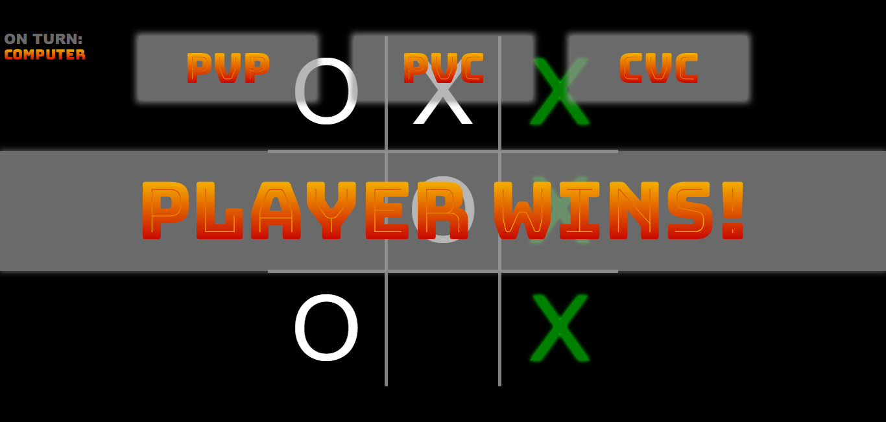

# Tic-Tac-Toe

- Responsive
- Three game modes available
- Build with HTML, CSS, and Vanilla JS

## Screenshot

## Author

- Website - [floatingPebble](https://github.com/floatingPebble)
- Frontend Mentor - [@floatingPebble](https://www.frontendmentor.io/profile/floatingPebble)
- Twitter - [@ShyToadGames](https://twitter.com/ShyToadGames)